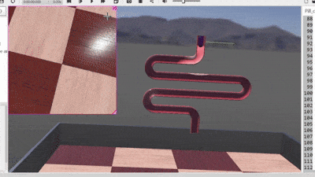
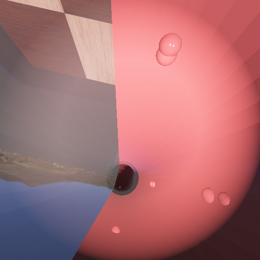

Markdown# Active Capsule Endoscopy Robot Simulation (Webots)

A 3D simulation of a manually controlled active capsule robot navigating a gastrointestinal (GI) tract model in Webots. 

This project implements an orientation-aware kinematic control script in Python, enabling clinicians to manually drive the capsule relative to its camera view axis while navigating complex 3D lumen bends. It also includes an event-driven sensor monitoring system to flag pathologies (tissue constrictions and fluid/blood regions) in real time without console spam.

Demonstration

Short Preview






> 📹 **Full Video Demo:** [Watch the complete video recording here](./full_demo.mp4)
## Demonstration

### Short Preview

<p align="center">
  
  
</p>

> 📹 **Full Video Demo:** [Watch the complete video recording here](./full_demo.mp4)

---

## Key Features

* **Local Orientation Steering:** Computes linear velocity vectors dynamically from the robot's $3 \times 3$ orientation matrix (`getOrientation()`). The camera always drives forward along its view heading regardless of global world coordinates or 3D pipe turns.
* **Multi-Sensor Payload:**
  * **CMOS Camera:** Real-time visual feed for mucosal inspection.
  * **Optical Distance Sensor:** Detects distance shifts caused by tissue occlusion or fluid/blood pools.
  * **Pressure Touch Sensor:** Measures wall contact forces to identify luminal constrictions or tight bends.
  * **Gyroscope:** Tracks angular velocity to ensure smooth manual turns.
* **Event-Driven Abnormality Alerts:** Threshold checks trigger console warnings only when an anomaly is detected (e.g., optical distance $< 0.05\text{ m}$ or contact pressure $> 0.5\text{ N}$). Non-blocking cooldown timers prevent console log spamming.
* **Diagnostic Snapshot System:** Captures high-resolution images (`.jpg`) to a local folder on demand along with corresponding telemetry metadata.
* **Physically Accurately Modeled GI Environment:** Uses a split CAD mesh for interior visualization (`front_shape` & `Back_Half`) bound by a single continuous physical collision object (`boundingObject`).

---

## Project Structure

```text
├── controllers/
│   └── Pill_controller/
│       └── Pill_controller.py      # Main Python control script
├── worlds/
│   └── gi_tract_simulation.wbt    # Webots world file with GI tract & capsule setup
├── captured_images/               # Folder where 'C' key snapshots are stored
└── README.md                      # Project documentation
How It WorksKinematic ControllerDriving in 3D pipe environments using global coordinates often causes directional drift. This controller extracts the local longitudinal vector components ($f_x, f_y, f_z$) from column 3 of the orientation matrix:Pythonrot_matrix = robot_node.getOrientation()
fx, fy, fz = rot_matrix[2], rot_matrix[5], rot_matrix[8]

# Target velocity aligned with camera view
vx = fx * DRIVE_SPEED
vy = fy * DRIVE_SPEED
vz = fz * DRIVE_SPEED
Telemetry & Alert FilteringInstead of printing sensor streams on every simulation step, telemetry is handled conditionally:Automated Alert: Fires once when optical or pressure thresholds are breached, then enters a 30-tick cooldown.Manual Telemetry (P): Prints a snapshot of all current sensor readings to the console.Image Capture (C): Saves the camera frame and logs the telemetry state at that exact moment.ControlsClick inside the 3D viewport in Webots to give it focus, then use the following keys:Key InputActionUP ARROWDrive Forward along camera facing vectorDOWN ARROWDrive Backward (Reverse)LEFT ARROWYaw Steer LeftRIGHT ARROWYaw Steer RightCCapture Image + Telemetry SnapshotPPrint Current Sensor Readings to ConsolePrerequisites & InstallationWebots Robot Simulator (R2023b or newer recommended): Download WebotsPython 3.x (Configured as Webots Python runtime).SetupClone this repository:Bashgit clone [https://github.com/your-username/active-capsule-endoscopy-webots.git](https://github.com/your-username/active-capsule-endoscopy-webots.git)
Open Webots.Select File -> Open World... and load worlds/gi_tract_simulation.wbt.Ensure the Pill_controller is assigned to the Robotic_Pill solid node in the scene tree.Press Play ($\blacktriangleright$) to start the simulation.
